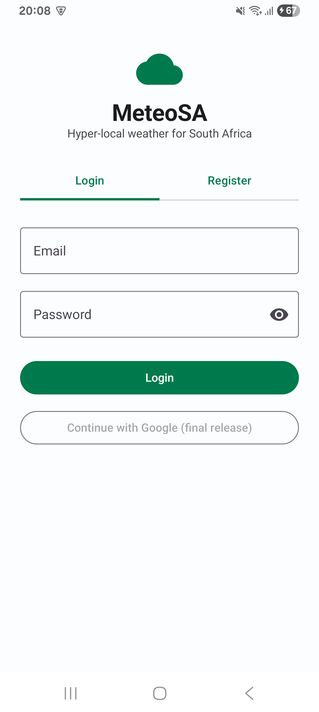
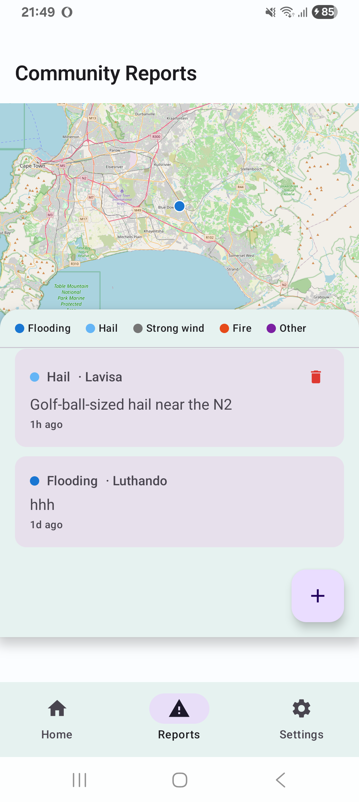
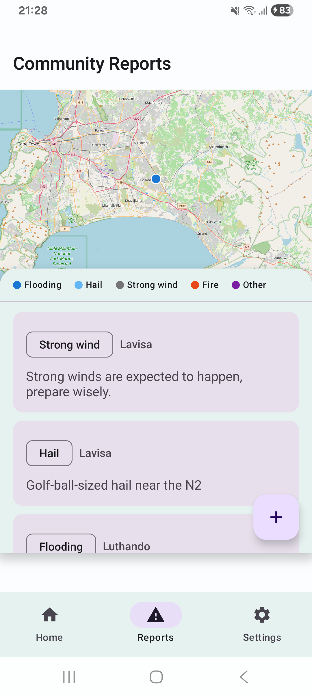
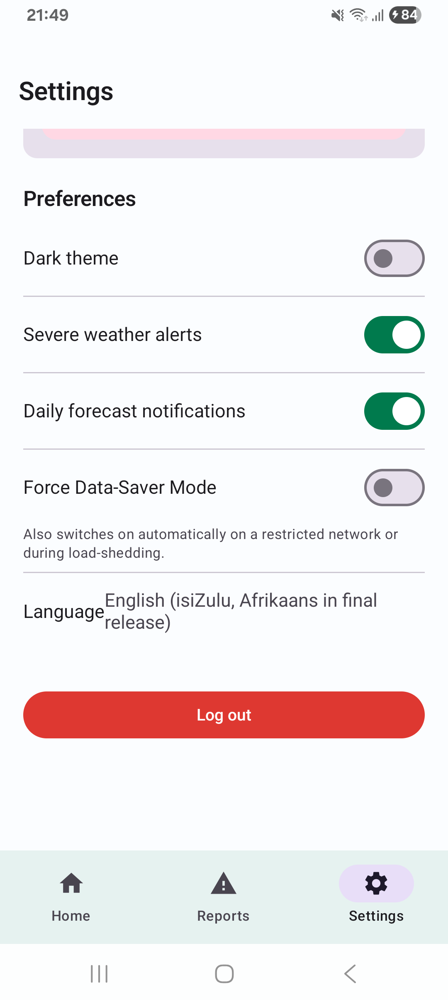

# MeteoSA

**MeteoSA** is an Android weather app built for the South African context, developed for the
OPSC6312 Portfolio of Evidence. It combines real-time weather data with a crowd-sourced
"Community Impact Reports" feed, so users don't just see a forecast - they see what the
weather is actually doing to people nearby (flooding, hail, wind damage) right now.

This repository contains **two projects**:

- `/app` - the Android client (Kotlin + Jetpack Compose).
- `/backend` - the custom REST API (Node.js/Express + Supabase Postgres) the app talks to.
  See [`backend/README.md`](backend/README.md) for API docs and deployment steps.

## Why MeteoSA

The Part 1 research report compared AccuWeather, The Weather Channel, and SA Weather. Global
apps (AccuWeather, TWC) have polished UIs but no South African context and a heavy resource
footprint; the local app (SA Weather) has great local relevance (loadshedding awareness) but a
dated UI and no multi-language support. MeteoSA's goal is to take the best of both: a modern,
lightweight Material 3 UI, plus features that matter specifically to South African users.

## Features in this prototype (Part 2)

Per the module brief, Part 2 requires sign-in, settings, a custom REST API, and app-specific
features - SSO, offline sync, push notifications, and multi-language are explicitly scoped to
the final PoE submission, so they aren't implemented yet (see "Deferred to the final PoE"
below).

| Feature | Notes |
|---|---|
| **Register / Login** | Email + password. Password is hashed with **BCrypt** server-side (`backend/src/routes/auth.js`) before it's stored; the app never stores or logs the plaintext. The session JWT is stored on-device in `EncryptedSharedPreferences` (AES-256, backed by the Android Keystore). |
| **Settings** | Dark/light theme toggle, notification-preference toggles, profile + gamification summary, logout. Persisted locally with Jetpack DataStore. |
| **Custom REST API** | Node.js/Express API with `users`, `auth`, and `reports` endpoints, backed by Supabase Postgres, deployed on Render. See `/backend`. |
| **Weather Dashboard** | Current conditions + 5-day forecast via the OpenWeatherMap free API, using the device's GPS location (falls back to Johannesburg if location is denied/unavailable). A locally-computed severe-weather banner appears for storm/extreme conditions. |
| **Community Impact Reports** | Users submit local weather-impact reports (flood/hail/wind/fire/other + description), stored via the custom REST API, and see a live feed of nearby reports. |
| **Gamification** | Submitting a report awards "Storm Chaser" points, with badge tiers shown on the Settings screen. |

### Deferred to the final PoE (as scoped by the brief)

- Single sign-on (Google)
- Offline mode with RoomDB + WorkManager sync
- Firebase Cloud Messaging push notifications
- isiZulu / Afrikaans localisation (the UI already routes all text through `strings.xml`, so
  this is mostly adding `values-zu/` and `values-af/` resource files)

## Architecture

MVVM, matching the Part 1 design document:

```
UI (Jetpack Compose screens)
   |
ViewModel (StateFlow<UiState<T>> per screen)
   |
Repository (AuthRepository / WeatherRepository / ReportsRepository)
   |
Retrofit API interfaces (BackendApi, WeatherApi)
```

Dependencies are wired up by hand in `di/AppContainer.kt` rather than with Hilt/Dagger. This
was a deliberate choice for this project: an annotation-processor-based DI framework adds a
kapt/KSP step to every single build, which meaningfully slows down local builds - something we
specifically want to avoid when building straight to a phone on a lower-spec PC without
Android Studio's tooling to smooth it over.

## Building the app (no Android Studio)

This project is built entirely from the command line / VS Code, using the Gradle wrapper.
Full setup instructions (JDK, Android SDK command-line tools, Gradle, VS Code, and how to
deploy to a physical phone) are in the message where this project was created - the short
version:

```powershell
# from the repository root
.\gradlew.bat assembleDebug      # builds app/build/outputs/apk/debug/app-debug.apk
.\gradlew.bat installDebug       # builds AND installs it on a connected/adb-paired phone
.\gradlew.bat testDebugUnitTest  # runs the JVM unit tests
```

`local.properties` (gitignored - never committed) must contain your Android SDK path and your
OpenWeatherMap API key. See `local.properties` in this repo for the exact keys expected, or
regenerate it from scratch using the setup guide.

## Continuous Integration

Two GitHub Actions workflows run automatically on every push/PR (`.github/workflows/`):

- **android-ci.yml**: sets up JDK 17 + the Android SDK, runs the Kotlin unit tests
  (`testDebugUnitTest`), builds a debug APK, and uploads it as a workflow artifact.
- **backend-ci.yml**: installs the backend's npm dependencies and runs its test suite
  (`node --test`), only when files under `backend/` change.

## Unit tests

- `app/src/test/.../DailyForecastTest.kt` - verifies the logic that collapses OpenWeatherMap's
  3-hourly, 5-day forecast into one summary card per day.
- `app/src/test/.../SettingsViewModelTest.kt` - verifies the gamification badge thresholds.
- `backend/src/util/geo.test.js` - verifies the Haversine distance calculation used to filter
  community reports by radius.

## Screenshots

| Login | Home Dashboard |
|---|---|
|  |  |

| Community Reports | Settings |
|---|---|
|  |  |

## Demo video

[Part 2 demonstration video](https://drive.google.com/file/d/1hkOiiqpe1PlpYy0-1O2JXCWfs50HBMma/view?usp=sharing)

## AI usage

See the separate AI-use write-up submitted alongside this PoE part.
